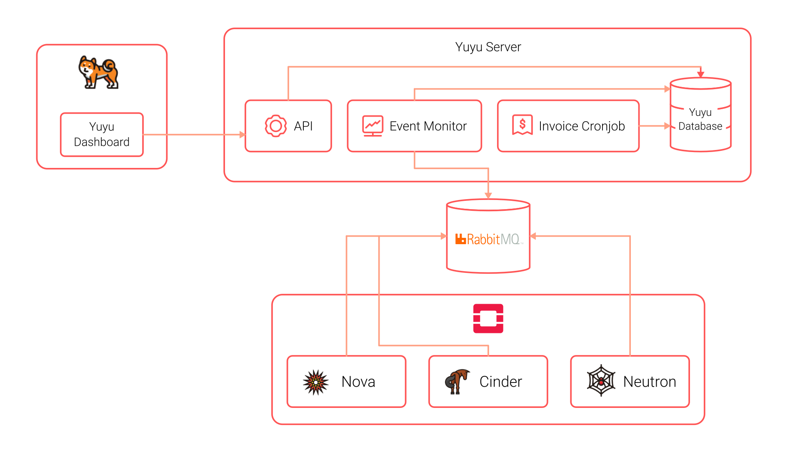

## **Yuyu Architecture**

---

## **Yuyu Components**
Yuyu have two components for running bellow :

### 1. Yuyu Server

Yuyu server provide ability to manage openstack billing by listening to every openstack event. Yuyu server is a required component to use Yuyu Dashboard. There are 3 main component in Yuyu server: API, Cron, Event Monitor. More detail about Yuyu server at [https://github.com/Yuyu-billing/yuyu](https://github.com/Yuyu-billing/yuyu)

- **Yuyu API** : Main component to communicate with Yuyu Dashboard.

- **Yuyu Cron** : Provide invoice calculation and rolling capabilities that needed to run every month.

- **Yuyu Event Monitor** : Monitor event from openstack to calculate billing spent.

### 2. Yuyu Dashboard

Yuyu dashboard is a panel at openstack dashboard that is used to manage your openstack bills. More detail about Yuyu server at [https://github.com/Yuyu-billing/yuyu_dashboard](https://github.com/Yuyu-billing/yuyu_dashboard)