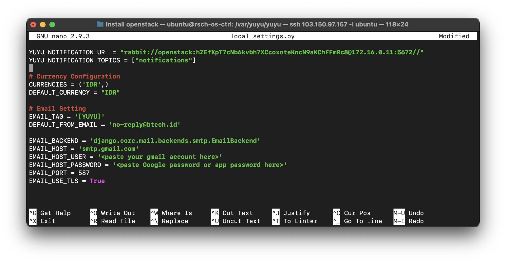
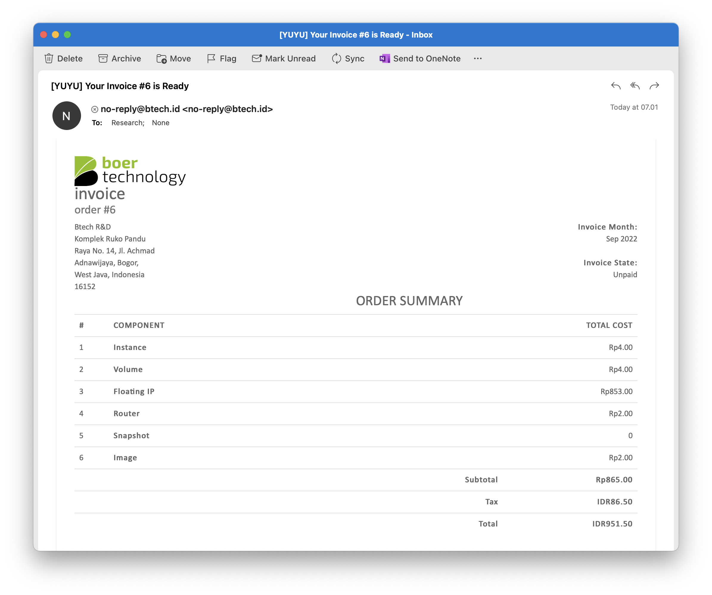

# Email activating

Besides from notification center, we can receive billing invoice using email, for configuration 

- Update local_settings.py configuration file

```
cd /var/yuyu/
nano yuyu/local_settings.py
```



- Running dataabase migration

```
python manage.py migrate
```

- After we configure email, now we received information from email




