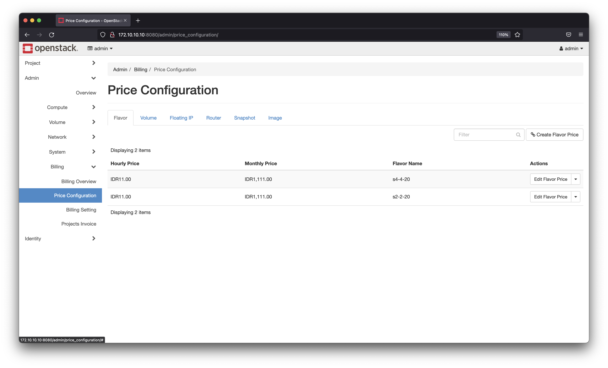
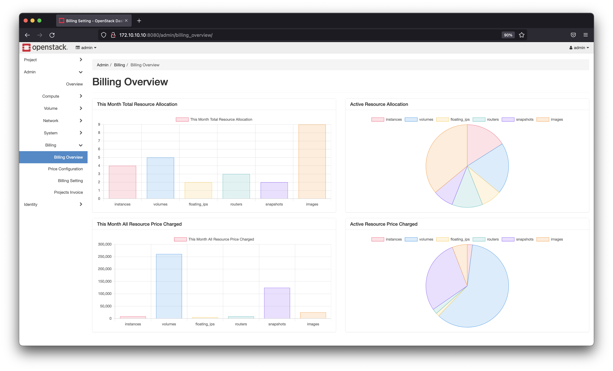
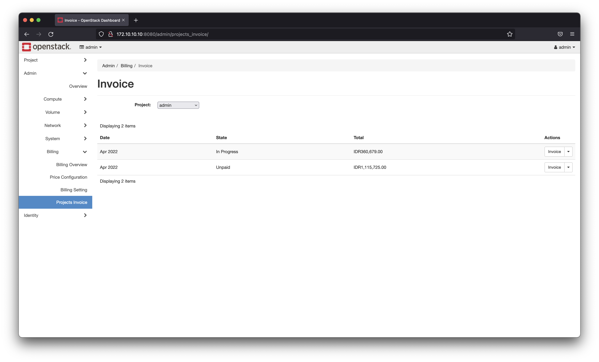
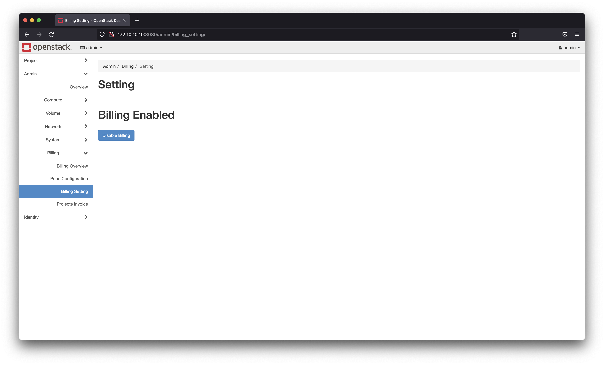
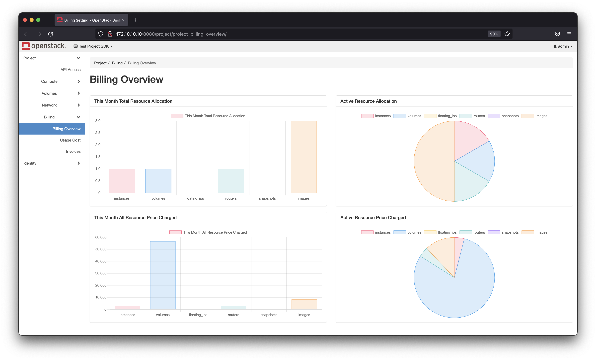
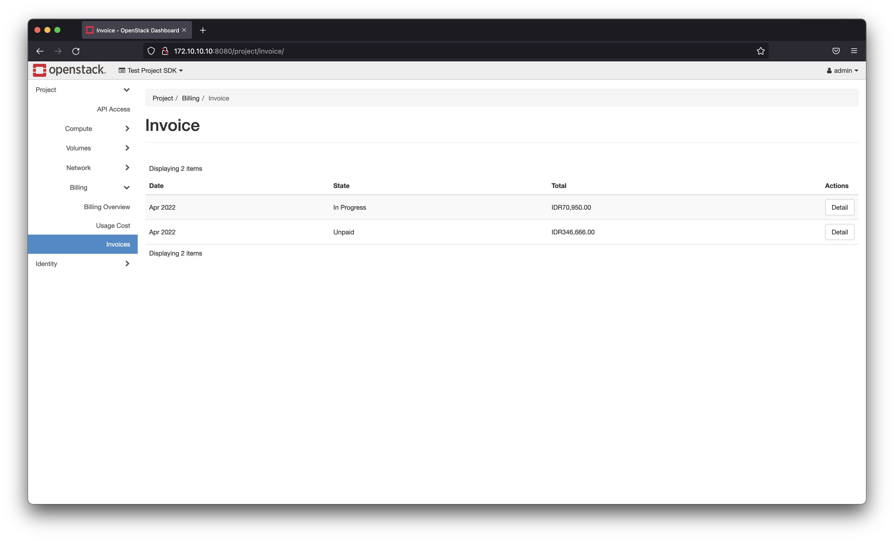
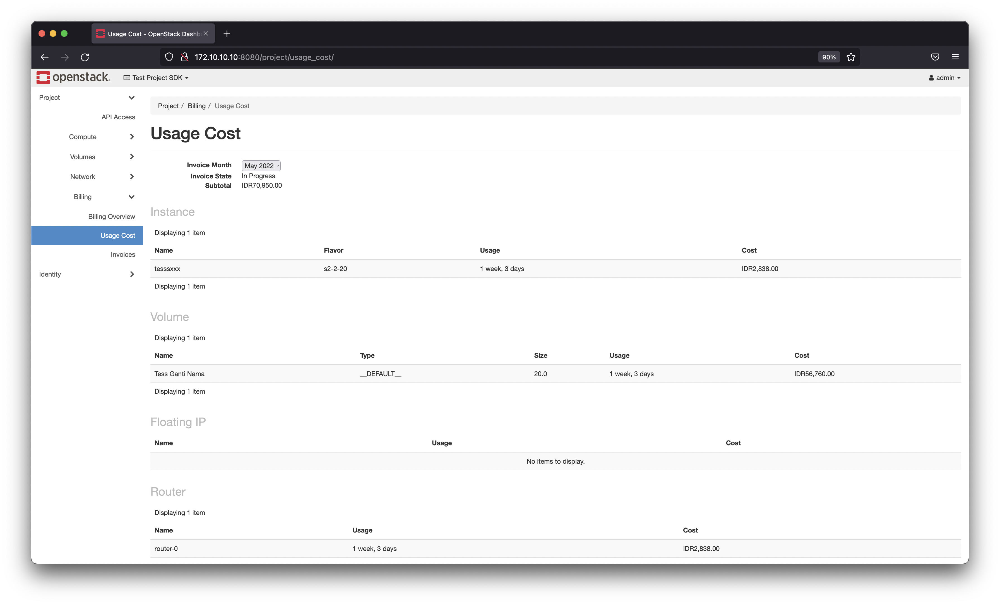

## **Admin Dashboard**

### 1. Price Configuration

You can set the price on your openstack feature on this page.

### 2. Project Overview

This page will display a summary of the usage of all projects on your openstack.

### 3. Projects Invoice
This page will show the total usage of openstack in each project every month.

### 4. Billing settings
Here for disable or enable billing setting

## **Project Dashboard**

### 1. Overview
Summary of the usage in a project.

### 2. Invoice
Your total openstack usage price

### 3. Usage Cost
Details of your openstack usage

